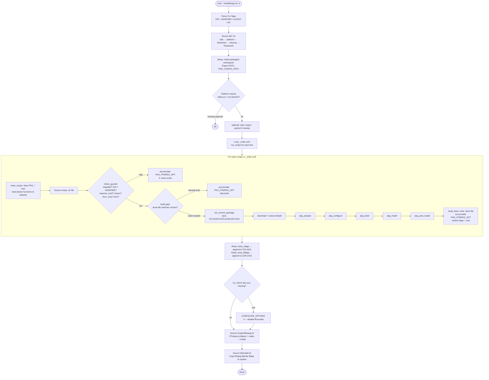
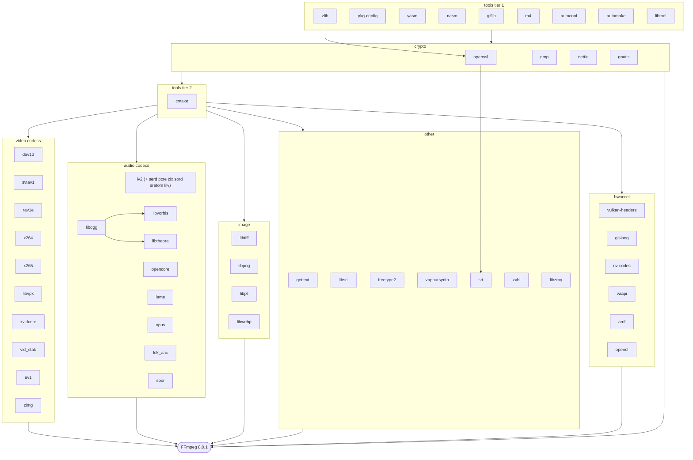
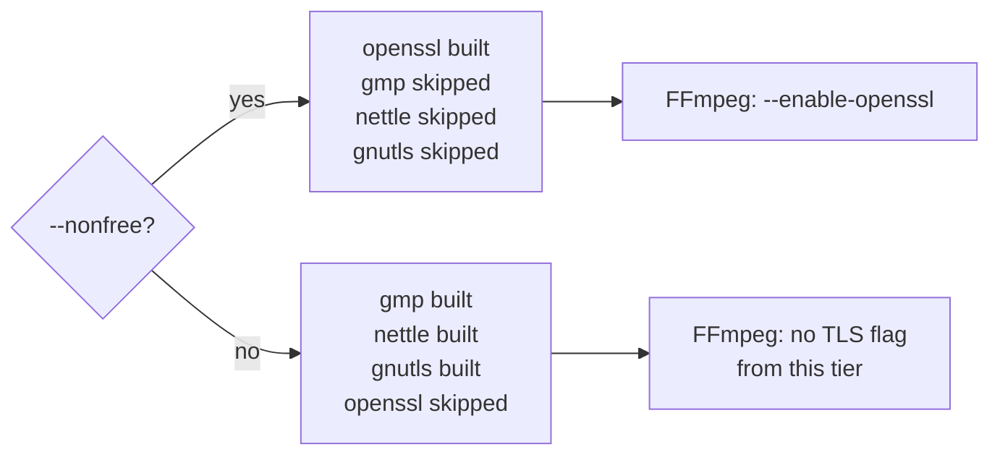
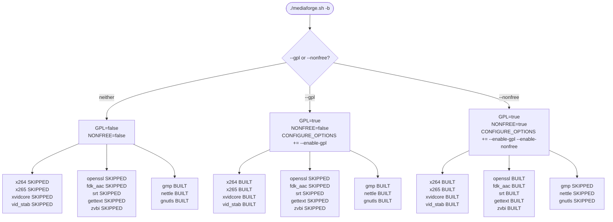
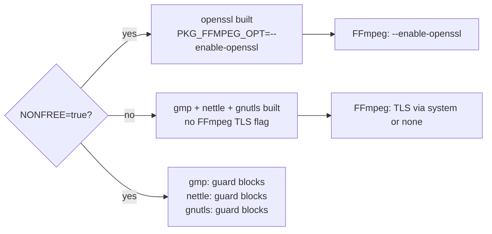
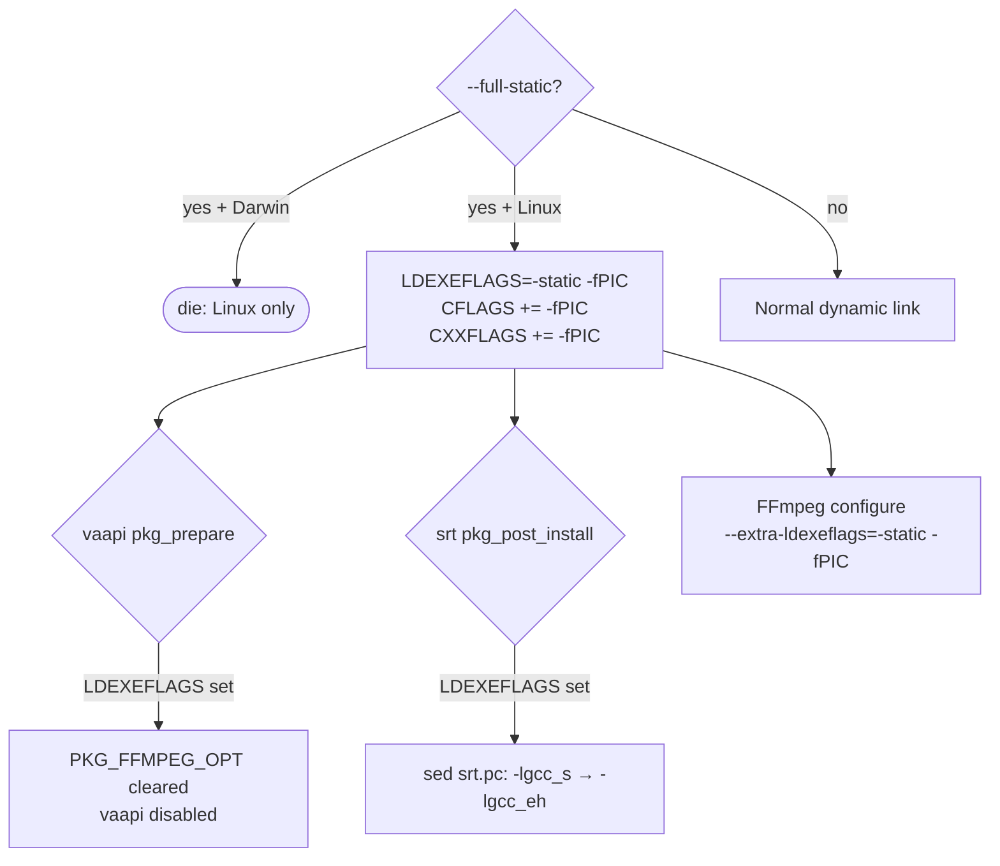
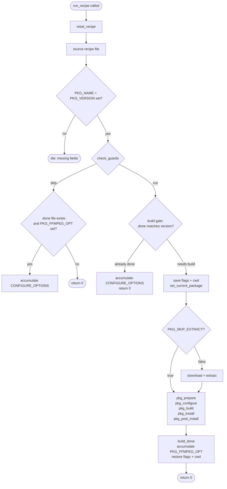
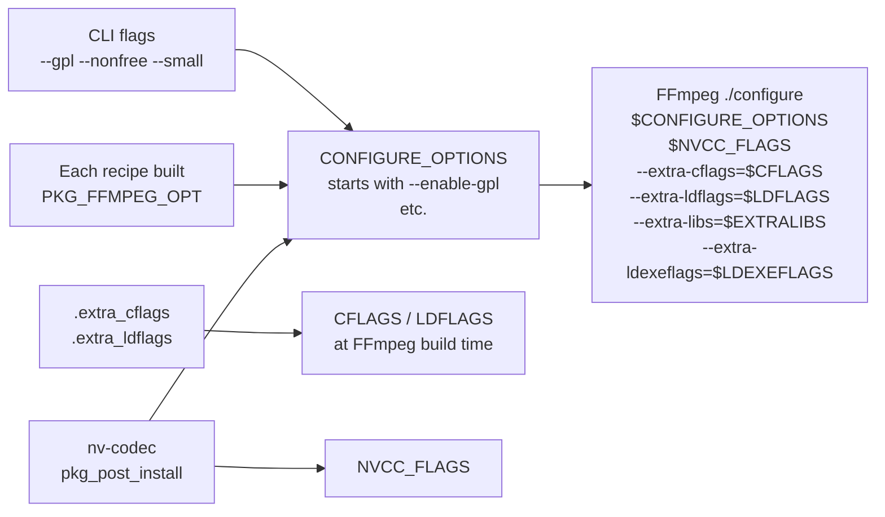

# mediaforge Project Map

> Version: 2.0 | FFmpeg target: 8.0.1 | Shell: POSIX sh (`#!/bin/sh`)
>
> This document is the authoritative reference for the mediaforge build system.
> It covers architecture, APIs, recipe catalog, dependency graph, platform
> behavior, and conditional logic paths.

---

## Table of Contents

1. [Overview](#1-overview)
2. [Build Flow](#2-build-flow)
3. [Core Library API](#3-core-library-api)
4. [Global Variables & Environment](#4-global-variables--environment)
5. [Recipe Framework](#5-recipe-framework)
6. [Recipe Catalog](#6-recipe-catalog)
7. [Dependency Graph](#7-dependency-graph)
8. [Platform Behavior](#8-platform-behavior)
9. [Shell Conventions](#9-shell-conventions)
10. [Conditional Logic Paths](#10-conditional-logic-paths)

---

## 1. Overview

mediaforge is a POSIX-shell build system that compiles FFmpeg 8.0.1 from source,
along with approximately 50 dependency libraries spanning video codecs, audio
codecs, image formats, crypto, hardware acceleration, and build tools.

It is a ground-up rewrite of
[markus-perl/ffmpeg-build-script](https://github.com/markus-perl/ffmpeg-build-script),
replacing a single monolithic Bash script with a portable, modular `#!/bin/sh`
architecture.

**Design goals**

- POSIX portability — runs on Linux, macOS (Intel + Apple Silicon), and FreeBSD
  without Bashisms
- Modularity — each dependency is an isolated recipe file; adding or removing
  a library requires only one file change plus one line in `_order.conf`
- Incremental builds — done-files (`packages/<name>.done`) prevent redundant
  rebuilds; `--latest` forces refresh
- Isolation — all artifacts stay inside `packages/` and `workspace/`; no system
  directories are touched until an explicit install step
- Licensing control — GPL and non-free codecs are gated behind explicit CLI flags;
  the default build produces a free-only binary

**Directory layout**

```
mediaforge.sh           CLI, sources lib/, drives _order.conf loop
lib/
  utils.sh              Logging, execute(), build gating, directory helpers
  platform.sh           OS/arch detection, MJOBS, MULTIARCH
  download.sh           curl download + tar extraction with cache
  cleanup.sh            EXIT/INT/TERM trap handler
  framework.sh          Recipe lifecycle: reset, guards, run_recipe()
  install.sh            Post-build binary installation
recipes/
  _order.conf           Declarative build order (one recipe path per line)
  ffmpeg.sh             Final FFmpeg configure + make
  tools/                Build infrastructure (10 packages)
  crypto/               TLS/crypto stack (4 packages, mutual exclusion)
  video/                Video codecs (10 packages)
  audio/                Audio codecs (9 packages)
  image/                Image format libraries (4 packages)
  hwaccel/              Hardware acceleration (6 packages)
  other/                Miscellaneous libraries (7 packages)
docs/
  project-map.md        This file
```

---

## 2. Build Flow

### End-to-end execution



### CLI options reference

| Flag | Effect |
|------|--------|
| `-b`, `--build` | Start the build (required for any build action) |
| `--gpl` | Set `GPL=true`; adds `--enable-gpl` to `CONFIGURE_OPTIONS` |
| `--nonfree` | Set `NONFREE=true`; implies `--gpl`; adds `--enable-nonfree` |
| `--disable-lv2` | Set `DISABLE_LV2=true`; skips lv2 + its 6 sub-deps |
| `-c`, `--cleanup` | Delete `packages/` and `workspace/` |
| `--latest` | Rebuild packages whose done-file version is outdated |
| `--small` | Adds `--enable-small --disable-doc`; sets `MANPAGES=0` |
| `--full-static` | Sets `LDEXEFLAGS="-static -fPIC"`, enables fPIC (Linux only) |
| `--skip-install` | Skip post-build binary installation |
| `--auto-install` | Install without prompting (mutually exclusive with `--skip-install`) |
| `--version` | Print `SCRIPT_VERSION` and exit |
| `-h`, `--help` | Print usage |

### Pre-flight checks

| Check | Severity |
|-------|----------|
| `make` | Fatal (`die`) |
| `g++` | Fatal (`die`) |
| `curl` | Fatal (`die`) |
| `cargo` | Warning — rav1e skipped |
| `python3` | Warning — dav1d and lv2 skipped |

---

## 3. Core Library API

### lib/utils.sh

| Function | Signature | Purpose |
|----------|-----------|---------|
| `log` | `log msg...` | Print `[mediaforge] msg` to stdout |
| `warn` | `warn msg...` | Print `[mediaforge] WARNING: msg` to stderr |
| `die` | `die msg...` | Print `[mediaforge] FATAL: msg` to stderr; `exit 1` |
| `execute` | `execute cmd [args...]` | Run command; capture output; die on non-zero exit |
| `execute_stdin` | `execute_stdin cmd [args...]` | Same as `execute` but logs `< (stdin)` |
| `command_exists` | `command_exists name` | Returns 0 if `name` is in PATH (`command -v`) |
| `library_exists` | `library_exists name` | Returns 0 if `pkg-config --exists name` succeeds |
| `make_dir` | `make_dir path` | Remove then `mkdir -p` a directory |
| `remove_dir` | `remove_dir path` | `rm -rf` a directory if it exists |
| `build` | `build name version` | Print header; return 0 if build needed, 1 if done-file matches |
| `build_done` | `build_done name version` | Write `version` to `packages/name.done` |
| `print_flags` | `print_flags` | Log current CFLAGS, CXXFLAGS, LDFLAGS, LDEXEFLAGS |

**`build()` logic**

```
if packages/name.done exists:
    if done_version == requested_version → return 1 (skip)
    elif LATEST=true → return 0 (rebuild)
    else → return 1 (skip, warn outdated)
else → return 0 (build)
```

### lib/platform.sh

| Function / Variable | Type | Value / Behavior |
|--------------------|------|-----------------|
| `OS_TYPE` | string | `$(uname -s)` — `Darwin`, `Linux`, `FreeBSD` |
| `OS_ARCH` | string | `$(uname -m)` — `x86_64`, `arm64`, etc. |
| `IS_DARWIN` | bool string | `true` if `OS_TYPE=Darwin` |
| `IS_LINUX` | bool string | `true` if `OS_TYPE=Linux` |
| `IS_FREEBSD` | bool string | `true` if `OS_TYPE=FreeBSD` |
| `IS_MACOS_SILICON` | bool string | `true` if `IS_DARWIN=true` and `OS_ARCH=arm64` |
| `MULTIARCH` | string | Debian multiarch triplet from `dpkg-architecture` or `gcc -dumpmachine` |
| `MJOBS` | integer string | Parallel job count (from `detect_jobs`) |
| `detect_jobs()` | function | `$NUMJOBS` env override → `/proc/cpuinfo` → `sysctl` → `nproc` → `4` |

### lib/download.sh

| Function | Signature | Purpose |
|----------|-----------|---------|
| `download` | `download URL [FILENAME [DIRNAME]]` | Download with curl + extract with tar |

**`download()` behavior**

- `FILENAME` defaults to `${URL##*/}` (basename of URL)
- `DIRNAME` is auto-detected from tarball suffix (`.tar.gz`, `.tar.xz`, `.tar.bz2`)
  if not specified; custom `DIRNAME` disables `--strip-components 1`
- Cache check: skip curl if `packages/FILENAME` already exists
- Retry: one 10-second sleep retry on curl failure
- Patch files (`*patch*` in name): downloaded but not extracted
- Changes directory to `packages/DIRNAME` after extraction

### lib/cleanup.sh

| Function | Signature | Purpose |
|----------|-----------|---------|
| `set_current_package` | `set_current_package name` | Store current package name for trap messages |
| `on_exit` | (trap handler) | On non-zero exit: warn with current package; preserve done-files; `cd $CWD` |
| `full_cleanup` | `full_cleanup` | `rm -rf packages/ workspace/`; log done |
| `setup_traps` | `setup_traps` | Register `on_exit` for `EXIT`; `exit 130` for `INT`; `exit 143` for `TERM` |

**Resume behavior**: `on_exit` preserves done-files on failure so successfully
built packages are not rebuilt on the next run.

### lib/framework.sh

| Function | Signature | Purpose |
|----------|-----------|---------|
| `default_configure` | (internal) | autoconf or cmake depending on `PKG_CMAKE` |
| `default_build` | (internal) | `make -j $MJOBS` |
| `default_install` | (internal) | `make install` |
| `default_noop` | (internal) | no-op (`:`) for prepare and post_install |
| `reset_recipe` | `reset_recipe` | Clear all `PKG_*` vars; reset phase functions to defaults |
| `check_guards` | `check_guards` | Evaluate all skip conditions; return 0=run 1=skip |
| `run_recipe` | `run_recipe path` | Full recipe lifecycle: reset → source → validate → guards → build → phases → done |

**`check_guards()` evaluation order**

1. `PKG_DISABLED=true` (e.g. `SKIPRAV1E=yes` env var)
2. `PKG_SKIP_IF_NONFREE=true && NONFREE=true` (mutual exclusion)
3. `PKG_GPL=true && GPL!=true`
4. `PKG_NONFREE=true && NONFREE!=true`
5. `PKG_REQUIRES_CMD` — each command checked with `command_exists`
6. `PKG_REQUIRES_MESON=true` — checks `meson` and `ninja`
7. `PKG_LINUX_ONLY=true && IS_LINUX!=true`
8. `PKG_SKIP_ON_ARCH` matches `$OS_ARCH`
9. `DISABLE_LV2=true && PKG_NAME=lv2`

**Skipped-but-previously-built accumulation**: When a recipe is skipped by
a guard OR the done-file check, `PKG_FFMPEG_OPT` is still accumulated into
`CONFIGURE_OPTIONS` if a `.done` file exists. This ensures previously built
optional packages continue to be linked.

### lib/install.sh

Install destination priority:

```
Darwin            → /usr/local
$HOME/.local      → $HOME/.local  (if exists)
/usr/local        → /usr/local    (if exists)
fallback          → /usr
```

Copies `ffmpeg`, `ffprobe`, `ffplay` from `workspace/bin/`. Uses `sudo` only
when target is under `/usr`. Installs man pages to `share/man/man1/` and runs
`mandb` if available.

---

## 4. Global Variables & Environment

### Set by mediaforge.sh at startup

| Variable | Default | Type | Lifecycle |
|----------|---------|------|-----------|
| `SCRIPT_VERSION` | `"2.0"` | string | constant |
| `FFMPEG_VERSION` | `"8.0.1"` | string | constant |
| `PROGNAME` | `$(basename $0)` | string | constant |
| `SCRIPT_DIR` | resolved script dir | string | constant |
| `CWD` | `$(pwd)` at invocation | string | constant |
| `PACKAGES` | `$CWD/packages` | string | constant |
| `WORKSPACE` | `$CWD/workspace` | string | constant |
| `CFLAGS` | `-I$WORKSPACE/include` | string | saved/restored per recipe; extra_cflags appended at end |
| `CXXFLAGS` | `-I$WORKSPACE/include` | string | saved/restored per recipe |
| `LDFLAGS` | `-L$WORKSPACE/lib` | string | saved/restored per recipe; extra_ldflags appended at end |
| `LDEXEFLAGS` | `""` | string | set by `--full-static` to `-static -fPIC` |
| `EXTRALIBS` | `-ldl -lpthread -lm -lz` | string | passed to FFmpeg `--extra-libs` |
| `CONFIGURE_OPTIONS` | `""` | string | accumulated by recipes and CLI flags |
| `NVCC_FLAGS` | `""` | string | set by nv-codec recipe |
| `GPL` | `false` | bool string | set by `--gpl` / `--nonfree` |
| `NONFREE` | `false` | bool string | set by `--nonfree` |
| `DISABLE_LV2` | `false` | bool string | set by `--disable-lv2` |
| `LATEST` | `false` | bool string | set by `--latest` |
| `MANPAGES` | `1` | integer string | set to `0` by `--small` |
| `SKIPINSTALL` | `""` | string | set to `"yes"` by `--skip-install` |
| `AUTOINSTALL` | `""` | string | set to `"yes"` by `--auto-install` |
| `PKG_CONFIG_PATH` | workspace + system paths | string | exported |
| `PATH` | `$WORKSPACE/bin:$PATH` | string | exported |
| `MACOS_LIBTOOL` | `""` or libtool path | string | Darwin only |
| `MULTIARCH` | `""` or triplet | string | from platform.sh |
| `MJOBS` | cpu count | string | from platform.sh |

### Accumulator files (written by recipes)

| File | Written by | Purpose |
|------|-----------|---------|
| `$WORKSPACE/.extra_cflags` | lv2 (lilv), nv-codec | Flags appended to CFLAGS before FFmpeg build |
| `$WORKSPACE/.extra_ldflags` | nv-codec | Flags appended to LDFLAGS before FFmpeg build |

### Apple Silicon overrides (set in mediaforge.sh)

```sh
export ARCH=arm64
export MACOSX_DEPLOYMENT_TARGET=11.0
CXX=$(command -v clang++)
export CXX
```

---

## 5. Recipe Framework

### Required PKG_* variables

| Variable | Required | Purpose |
|----------|----------|---------|
| `PKG_NAME` | yes | Package identifier, used for done-file and logging |
| `PKG_VERSION` | yes | Version string written to done-file |
| `PKG_URL` | yes (unless `PKG_SKIP_EXTRACT=true`) | Tarball download URL |

### Optional PKG_* variables

| Variable | Default | Purpose |
|----------|---------|---------|
| `PKG_FILENAME` | basename of URL | Override downloaded filename |
| `PKG_DIRNAME` | derived from filename | Override extraction directory name |
| `PKG_SKIP_EXTRACT` | `false` | Skip download+extract (header-only or system packages) |
| `PKG_FFMPEG_OPT` | `""` | FFmpeg `./configure` flag(s) to accumulate |
| `PKG_GPL` | `false` | Skip unless `GPL=true` |
| `PKG_NONFREE` | `false` | Skip unless `NONFREE=true` |
| `PKG_SKIP_IF_NONFREE` | `false` | Skip when `NONFREE=true` (mutual exclusion) |
| `PKG_REQUIRES_CMD` | `""` | Space-separated commands that must exist in PATH |
| `PKG_REQUIRES_MESON` | `false` | Require both `meson` and `ninja` |
| `PKG_LINUX_ONLY` | `false` | Skip on non-Linux |
| `PKG_SKIP_ON_ARCH` | `""` | Skip when `OS_ARCH` matches this value |
| `PKG_DISABLED` | `false` | Skip unconditionally (set by env-var patterns) |
| `PKG_CMAKE` | `false` | Use cmake in `default_configure` instead of autoconf |
| `PKG_CONFIGURE_FLAGS` | `""` | Extra flags for `default_configure` |
| `PKG_CMAKE_FLAGS` | `""` | Extra flags for cmake in `default_configure` |

### Phase functions

Each recipe may override any subset of these functions. Unoverridden phases
use the defaults defined in `framework.sh`.

| Phase | Default behavior | Override purpose |
|-------|-----------------|-----------------|
| `pkg_prepare()` | no-op | Patches, environment setup, sub-dependency builds |
| `pkg_configure()` | `./configure --prefix=$WORKSPACE --disable-shared --enable-static $PKG_CONFIGURE_FLAGS` or cmake | Custom configure invocation |
| `pkg_build()` | `make -j $MJOBS` | Custom build command (ninja, cargo, etc.) |
| `pkg_install()` | `make install` | Custom install (ninja install, cargo cinstall, header copy) |
| `pkg_post_install()` | no-op | Extra flags, pkgconfig fixups, accumulator file writes |

### Compiler flag isolation

Before running a recipe, `run_recipe()` saves `CFLAGS`, `CXXFLAGS`, `LDFLAGS`,
`CPPFLAGS` and the working directory. These are restored after `pkg_post_install`.
Recipes that need to persist flag changes must write to the accumulator files
rather than modifying the global variables directly.

### Env-var disable pattern

Recipes can be disabled at runtime via environment variables without modifying
recipe files. Example from `rav1e.sh`:

```sh
if [ "$SKIPRAV1E" = "yes" ]; then
  PKG_DISABLED=true
fi
```

Set `SKIPRAV1E=yes ./mediaforge.sh -b` to skip rav1e.

---

## 6. Recipe Catalog

### tools (10 packages) — build infrastructure, no FFmpeg options

| Package | Version | FFmpeg opt | Guards | Notes |
|---------|---------|-----------|--------|-------|
| giflib | 5.2.2 | — | — | Image library dependency |
| pkg-config | 0.29.2 | — | — | pkg-config tool, built before cmake |
| yasm | 1.3.0 | — | — | x86 assembler (older) |
| nasm | 2.16.01 | — | — | x86 assembler (primary) |
| zlib | 1.3.1 | — | — | Compression, required by openssl |
| m4 | 1.4.19 | — | — | Macro processor for autoconf |
| autoconf | 2.72 | — | — | Build system generator |
| automake | 1.17 | — | — | Makefile generator |
| libtool | 2.4.7 | — | — | Shared library tool |
| cmake | 3.31.7 | — | — | Built after crypto (requires zlib) |

### crypto (4 packages) — TLS stack with mutual exclusion

| Package | Version | FFmpeg opt | Guards | Notes |
|---------|---------|-----------|--------|-------|
| openssl | 3.5.4 | `--enable-openssl` | `PKG_NONFREE=true` | Custom `./Configure`; links with zlib |
| gmp | 6.3.0 | — | `PKG_SKIP_IF_NONFREE=true` | GnuTLS dependency; skipped when openssl active |
| nettle | 3.10.2 | — | `PKG_SKIP_IF_NONFREE=true` | GnuTLS dependency; skipped when openssl active |
| gnutls | 3.8.11 | — | `PKG_SKIP_IF_NONFREE=true`, `PKG_SKIP_ON_ARCH=arm64` | Free TLS; skipped when openssl active or on arm64 |

**Mutual exclusion**: gmp, nettle, and gnutls carry `PKG_SKIP_IF_NONFREE=true`.
When `--nonfree` is set, openssl is built instead, and the GnuTLS chain is
skipped entirely.

### video (10 packages)

| Package | Version | FFmpeg opt | Guards | Build system |
|---------|---------|-----------|--------|-------------|
| dav1d | 1.5.3 | `--enable-libdav1d` | requires python3+meson | meson+ninja; arm64 CFLAGS override |
| svtav1 | 3.1.2 | `--enable-libsvtav1` | — | cmake |
| rav1e | 0.8.1 | `--enable-librav1e` | requires cargo; `SKIPRAV1E=yes` disables | cargo cinstall; sets RUSTFLAGS |
| x264 | 0480cb05 | `--enable-libx264` | `PKG_GPL=true` | autoconf; Linux adds `-fPIC`; post_install: install-lib-static |
| x265 | 4.1 | `--enable-libx265` | `PKG_GPL=true` | cmake |
| libvpx | 1.15.2 | `--enable-libvpx` | — | autoconf |
| xvidcore | 1.3.7 | `--enable-libxvid` | `PKG_GPL=true` | autoconf |
| vid_stab | 1.1.1 | `--enable-libvidstab` | `PKG_GPL=true` | cmake |
| av1 | d772e334 (git) | `--enable-libaom` | — | cmake (AOM reference encoder) |
| zimg | 3.0.6 | `--enable-libzimg` | — | autoconf |

### audio (9 packages)

| Package | Version | FFmpeg opt | Guards | Notes |
|---------|---------|-----------|--------|-------|
| lv2 | 1.18.10 | `--enable-lv2` | requires python3+meson; `--disable-lv2` | Umbrella recipe; builds 7 sub-deps inline (waflib, serd, pcre, zix, sord, sratom, lilv); writes `.extra_cflags` |
| opencore | 0.1.6 | `--enable-libopencore_amrnb --enable-libopencore_amrwb` | — | AMR codecs |
| lame | 3.100 | `--enable-libmp3lame` | — | MP3 encoder |
| opus | 1.6 | `--enable-libopus` | — | Opus codec |
| libogg | 1.3.6 | — | — | Dependency for libvorbis + libtheora |
| libvorbis | 1.3.7 | `--enable-libvorbis` | — | Depends on libogg |
| libtheora | 1.2.0 | `--enable-libtheora` | — | Depends on libogg |
| fdk_aac | 2.0.3 | `--enable-libfdk-aac` | `PKG_NONFREE=true` | Fraunhofer AAC encoder |
| soxr | 0.1.3 | `--enable-libsoxr` | — | Sample rate converter |

### image (4 packages)

| Package | Version | FFmpeg opt | Guards | Notes |
|---------|---------|-----------|--------|-------|
| libtiff | 4.7.1 | — | — | Dependency for libwebp |
| libpng | 1.6.53 | — | — | Dependency for libwebp |
| libjxl | 0.11.1 | `--enable-libjxl` | — | JPEG XL codec |
| libwebp | 1.6.0 | `--enable-libwebp` | — | WebP codec |

### hwaccel (6 packages)

| Package | Version | FFmpeg opt | Guards | Notes |
|---------|---------|-----------|--------|-------|
| vulkan-headers | 1.4.338 | `--enable-vulkan` | — | Header-only cmake install |
| glslang | 16.1.0 | `--enable-libglslang` | requires python3 | Runs `update_glslang_sources.py` in prepare |
| nv-codec | 11.1.5.3 | `--enable-cuda-nvcc --enable-cuvid --enable-nvdec --enable-nvenc --enable-cuda-llvm --enable-ffnvcodec` | `PKG_LINUX_ONLY`, requires nvcc | Writes `.extra_cflags`/`.extra_ldflags`; sets NVCC_FLAGS; CUDA_COMPUTE_CAPABILITY env var |
| vaapi | 1 | `--enable-vaapi` | `PKG_LINUX_ONLY`, `PKG_SKIP_EXTRACT=true` | No-build; checks libva; skipped in full-static mode |
| amf | 1.5.0 | `--enable-amf` | `PKG_LINUX_ONLY` | AMD GPU acceleration |
| opencl | 2025.07.22 | `--enable-opencl` | `PKG_LINUX_ONLY` | OpenCL headers |

### other (7 packages)

| Package | Version | FFmpeg opt | Guards | Notes |
|---------|---------|-----------|--------|-------|
| gettext | 0.22.5 | — | `PKG_NONFREE=true` | i18n runtime |
| libsdl | 2.32.10 | — | — | Required for ffplay |
| freetype2 | 2.14.1 | `--enable-libfreetype` | — | Font rendering |
| vapoursynth | 73 | `--enable-vapoursynth` | — | Header-only install (no configure/build) |
| srt | 1.5.4 | `--enable-libsrt` | `PKG_NONFREE=true` | Depends on openssl; `--full-static` fixup in post_install (sed -lgcc_s → -lgcc_eh) |
| zvbi | 0.2.44 | `--enable-libzvbi` | `PKG_NONFREE=true` | Teletext decoding |
| libzmq | 4.3.5 | `--enable-libzmq` | — | ZeroMQ messaging |

---

## 7. Dependency Graph

### Build order rationale



### Mutual exclusion paths

The crypto tier contains the only explicit mutual exclusion in the build:



**Why**: openssl is non-free (patent concerns). The GnuTLS stack provides a
free alternative. Both cannot be linked simultaneously.

**Additional gnutls exclusion**: `PKG_SKIP_ON_ARCH=arm64` — gnutls is also
skipped on Apple Silicon regardless of the nonfree setting.

### Sub-dependency graph: lv2

The lv2 recipe is an umbrella that builds 7 related packages inline using
nested `build`/`build_done` calls within `pkg_install`:

```
lv2 (meson, requires python3)
├── waflib (b600c92)  — build utility, downloaded but no install
├── serd (0.32.6)     — RDF syntax library
├── pcre (8.45)       — regex library
├── zix (0.8.0)       — intrusive data structure library
├── sord (0.16.20)    — RDF quad store
├── sratom (0.6.20)   — atom serialisation
└── lilv (0.26.2)     — LV2 plugin host library
    └── post_install: writes -I$WORKSPACE/include/lilv-0 to .extra_cflags
```

### nv-codec CUDA chain

When `nvcc` is in PATH on Linux:

```
nv-codec-headers installed
→ .extra_cflags: -I/usr/local/cuda/include
→ .extra_ldflags: -L/usr/local/cuda/lib64
→ CONFIGURE_OPTIONS += --enable-cuda-nvcc --enable-cuvid --enable-nvdec
                       --enable-nvenc --enable-cuda-llvm --enable-ffnvcodec
→ NVCC_FLAGS set for gencode arch (default sm_52)
```

When `nvcc` is absent on Linux:

```
nv-codec skipped (PKG_REQUIRES_CMD="nvcc" fails)
→ mediaforge.sh adds --disable-ffnvcodec to CONFIGURE_OPTIONS
```

---

## 8. Platform Behavior

### Detection matrix

| Flag | Darwin x86_64 | Darwin arm64 | Linux x86_64 | Linux arm64 | FreeBSD |
|------|:---:|:---:|:---:|:---:|:---:|
| `IS_DARWIN` | true | true | false | false | false |
| `IS_LINUX` | false | false | true | true | false |
| `IS_FREEBSD` | false | false | false | false | true |
| `IS_MACOS_SILICON` | false | true | false | false | false |

### Behavior differences by platform

| Feature | Linux | macOS Intel | macOS Silicon | FreeBSD |
|---------|-------|------------|--------------|---------|
| `--full-static` | supported | blocked (die) | blocked (die) | — |
| `--enable-videotoolbox` | no | yes (added to CONFIGURE_OPTIONS) | yes | no |
| CUDA / nv-codec | yes (if nvcc present) | no (Linux-only guard) | no | no |
| vaapi | yes | no (Linux-only guard) | no | no |
| amf | yes | no (Linux-only guard) | no | no |
| opencl | yes | no (Linux-only guard) | no | no |
| gnutls | yes | yes (x86_64 only) | no (arm64 skip) | — |
| dav1d CFLAGS | normal | normal | `-arch arm64` override in configure | normal |
| CXX override | no | no | `clang++` (required) | no |
| ARCH env var | no | no | `arm64` (exported) | no |
| MACOSX_DEPLOYMENT_TARGET | — | — | `11.0` | — |
| Install path | `/usr` or `$HOME/.local` or `/usr/local` | `/usr/local` | `/usr/local` | `/usr` or `$HOME/.local` |
| libtool variable | `""` | path from `command -v libtool` | path from `command -v libtool` | `""` |
| MJOBS detection | `/proc/cpuinfo` or `nproc` | `sysctl machdep.cpu.thread_count` | `sysctl machdep.cpu.thread_count` | `nproc` or 4 |
| MULTIARCH | dpkg-architecture or gcc -dumpmachine | — | — | — |

### Full static build (Linux only)

When `--full-static` is passed:

```sh
LDEXEFLAGS="-static -fPIC"
CFLAGS="$CFLAGS -fPIC"
CXXFLAGS="$CXXFLAGS -fPIC"
```

These are passed to FFmpeg configure as `--extra-ldexeflags` and `--extra-cflags`.

Additionally, `srt.sh::pkg_post_install` detects `LDEXEFLAGS` and patches
`srt.pc` to replace `-lgcc_s` with `-lgcc_eh` (required for full-static linking).

`vaapi.sh::pkg_prepare` detects `LDEXEFLAGS` and clears `PKG_FFMPEG_OPT`,
effectively disabling VAAPI when full-static is requested.

---

## 9. Shell Conventions

### POSIX-only patterns

All code must be compatible with `#!/bin/sh` (not bash). The following patterns
are enforced:

| Avoid (Bash) | Use instead (POSIX) |
|-------------|---------------------|
| `[[ ]]` | `[ ]` |
| `which cmd` | `command -v cmd` |
| `str+=more` | `str="${str}more"` |
| Arrays `arr=()` | Space-separated strings |
| `=~` regex match | `case` or `expr` |
| `{a,b}` brace expansion | explicit repetition |
| `<(cmd)` process substitution | temp file or pipe |
| `echo -e` | `printf` |
| `sed -i` | `sed '...' file > tmp && mv tmp file` |
| `local var` | prefix with `_` (e.g. `_pkg`) |

### Variable naming

| Scope | Convention | Example |
|-------|-----------|---------|
| Global build state | `UPPER_CASE` | `CFLAGS`, `GPL`, `PACKAGES` |
| Package metadata | `PKG_UPPER_CASE` | `PKG_NAME`, `PKG_GPL` |
| Platform flags | `IS_UPPER_CASE` | `IS_LINUX`, `IS_DARWIN` |
| Function-local | `_lower_case` with `_` prefix | `_pkg`, `_ver`, `_rc` |
| Loop variables | `_lower_case` with `_` prefix | `_recipe`, `_flag` |

### Boolean values

Booleans are shell strings compared with `[ "$var" = true ]`. They are never
numeric. Default false values are always the string `"false"` (not empty or 0).

### Error handling

All external commands inside recipes must be wrapped in `execute` so that
failures are caught and reported with the command line shown. Direct invocations
(without `execute`) are only used when failure is intentionally tolerated.

### Portable file operations

```sh
# Correct: read file line by line
while IFS= read -r _line || [ -n "$_line" ]; do
  ...
done < file

# Correct: append to accumulator
printf '%s\n' "$_value" >> "$WORKSPACE/.extra_cflags"

# Correct: in-place file edit
sed 's/old/new/g' file > file.tmp && mv file.tmp file
```

The `|| [ -n "$_line" ]` guard handles files without a trailing newline.

---

## 10. Conditional Logic Paths

### GPL codec path



### Non-free crypto mutual exclusion



### Full static binary path



### Recipe build decision tree



### Flag accumulation flow



---

*End of mediaforge Project Map*
